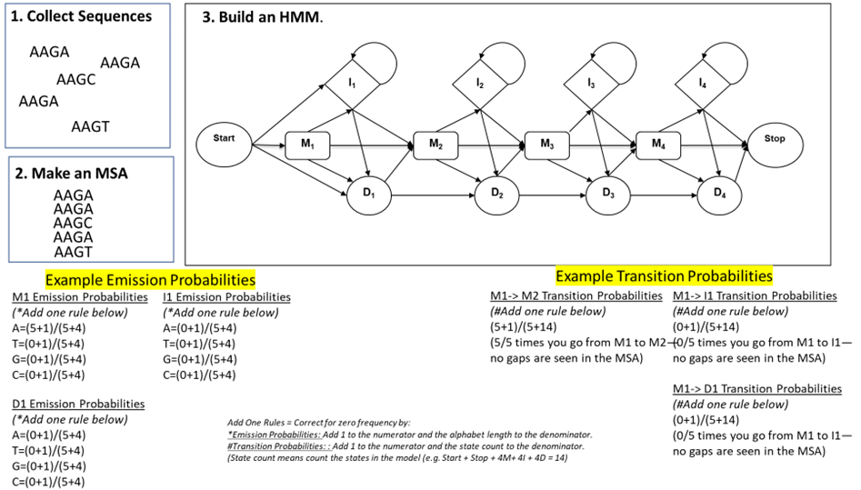
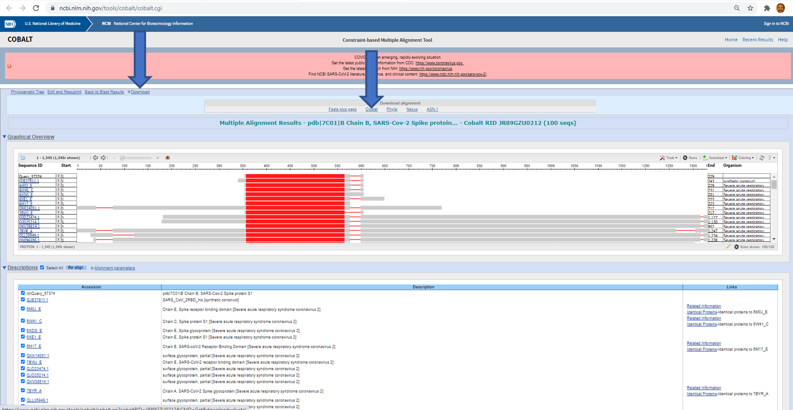

# Computational Practice: Local HMM search: use a local HMMER software install to search databases with HMMs

##  Lab Overview
Hidden Markov Models (HMMs) are built from Multiple Sequence Alignments (MSAs) and can be used to score new sequences against the information in the MSA.  HMMs are a lot like PSSMs expect they model gaps in a sequence alignment.  Here is a map of how to build an HMM from an MSA:
![]

There is a suite of software that helps build HMMs and search databases with HMMs.  It’s called HMER.  Here is the HMMER User’s Guide: http://eddylab.org/software/hmmer/Userguide.pdf

##  Lab Objectives:
In this lab you will build a Multiple Sequence Alignment (MSA) from a set of SARS-Cov-2 coronavirus spike’ protein homologs.

* Install HMMER software on a Linux system.
* Find a spike protein seed sequence in the NCBI protein da## ase.
* Find BLAST hit sequences similar to this protein.
* Build and MSA from the hits.
* Build an HMM model from the MSA using the HMMER package.

Follow these lab instructions:

#### Step 1. Install HMMER suite on Palmetto2.
```
#Load the anaconda environment creation software module pre-installed on Palmetto
module load anaconda3/2023.09-0 

# Create and activate  personal conda environment for sequence alignment tools
conda create -n alignment_env
source activate alignment_env

# Install HMMER packages in this environment
conda install hmmer
```
Note: You must always activate the environment to use software .  The environment is reset when you log back into the cluster. ```

#### Step 2. Find a seed sequence.
Find the SARS-Cov-2 Spike protein by searching the NCBI protein database with this PDB identifier: ‘7C01_B’.  Grab the FASTA sequence and save it in a text file.  Call it something like ‘7C01_B.fasta’.

#### Step 3. Find potetial homologs of the seed sequence.
BLASTP the sequence against the ncbi nr protein database with and E-value less than 0.001.

#### Step 4. Build a Multiple Sequence Alignment (MSA) of the align homologs.
Once the BLASTP is done, click on the Multiple Sequence Alignment COBALT tool on the hit page.  Save the MSA by clicking Download and then Clustal format for all the BLAST hits in Clustal MSA format.  Call it something like ‘JR89GZU0212-alignment.aln’. You can look at the file using the ‘cat JR89GZU0212-alignment.aln’ command line in a terminal.

![] 

#### Step 5. Build an HMM 
Using this command line in a terminal on Palmetto2: 
```
hmmbuild JR89GZU0212-alignment.hmm JR89GZU0212-alignment.aln
```
Now you have an HMM model built from similar SARS-Cov-2 spike proteins!  You can peek into the file with the ‘cat’ command on the command line.


